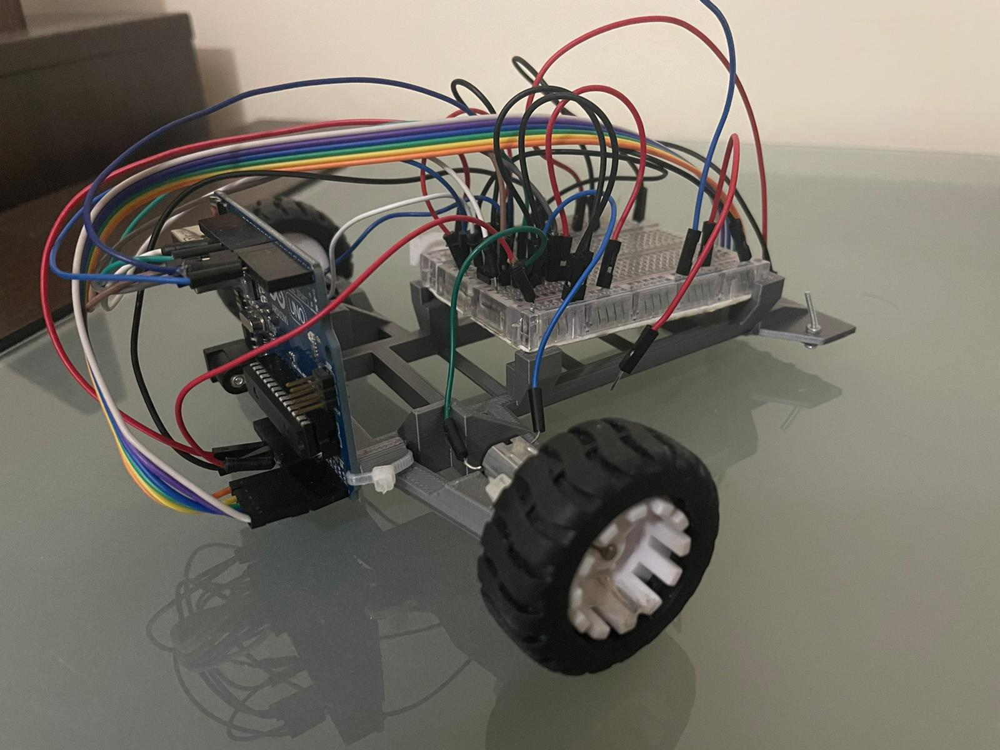

# Line-Follower

Line follower robot developed within the "Introduction to Robotics" course, 3rd year, 1st semester.   
This was a team project.

:camera: Picture of the setup:     
   

:hammer_and_wrench: Components:   
1. Arduino Uno  
2. Zip-ties  
3. Power source (can be of different shape). In my case, a LiPo battery 
4. Wheels (2)  
5. Wires for the line sensor (female - male)  
6. QTR-8A reflectance sensor, along with screws  
7. Ball caster  
8. Extra wires from the kit or lab  
9. Chassis10.Breadboard - medium (400pts)  
11. L293D motor driver  
12. DC motors (2)

💠 Technical Task:   
&emsp; Build a line follower robot that has to finish a given route as quick as possible, using a **PID controller**.
Before the robot starts to follow the black line, it has to **auto calibrate**, meaning moving to the left and right to distinguish between different colors by using the sensors attached.    
&emsp; Also it is important to follow the black line no matter what (for example even if there are 2 close curves). It is already known there will be no intersections. 

:thinking: Challenges encountered:
- Calibration: We had to use millis() while calibrating the robot. Also, the motors didn't move the same, meaning they didn't have the same power when given a specific speed, so we had to try different cases to find a good balance. In the end we chose to read values from the sensors and move to left and right accordingly, so that the robot's sensors would detect plain white and plain black too.  
- PID controller: We had to fine tune the kp, kd, ki values from the PID controller (as well as other ones) in order to find a good combination for our robot.
- Hardware: Powering the robot required a lot of attention, because we used LiPo batteries.

🔶 Other details:  
Coding style is important.  
Magic numbers are not accepted and consistentency in style is desired.

**In the end, we managed to get an approximate finish time of 21 seconds.**

:film_projector: [Video showcasing the functionality]()   
